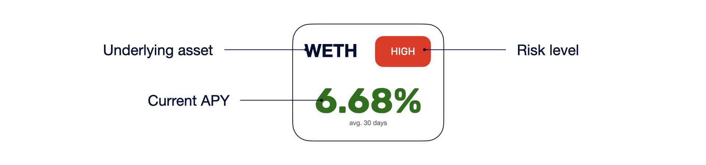
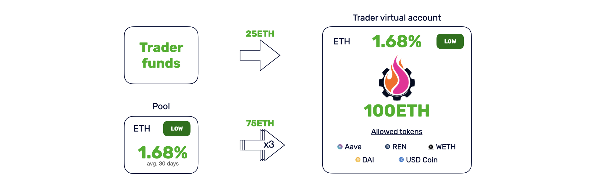
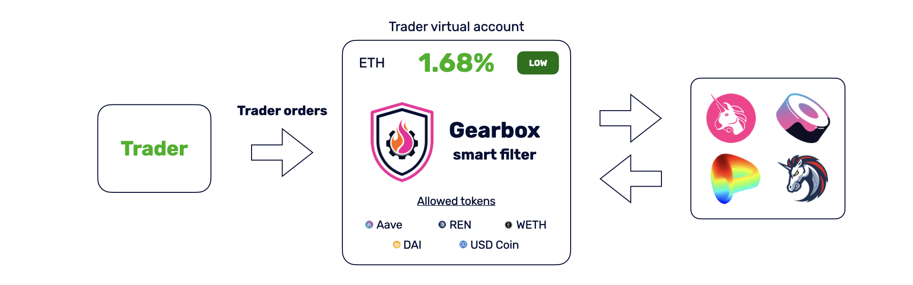
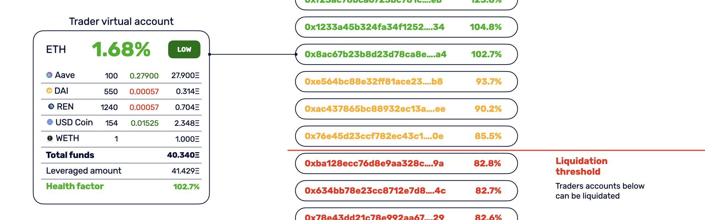
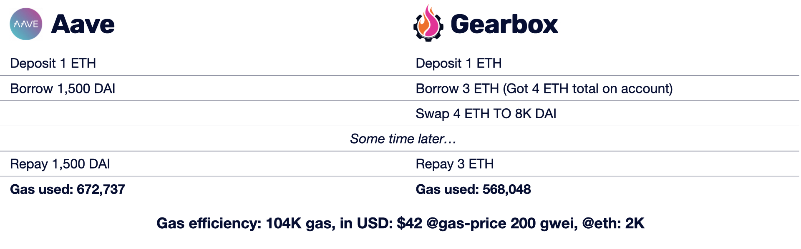
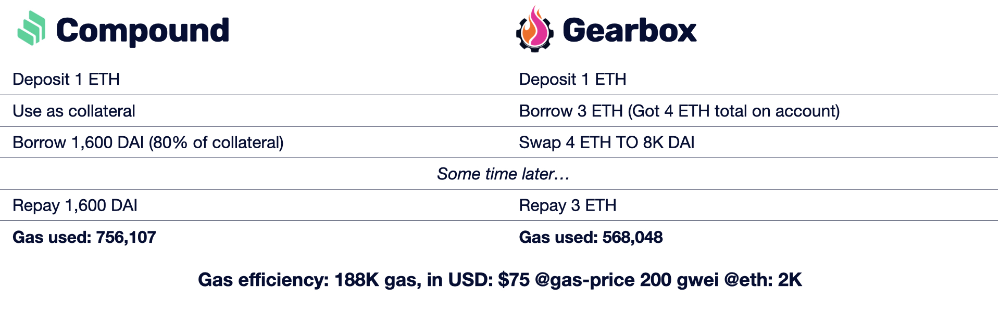

## Gearbox protocol
Gearbox is undercollateralized protocol for margin trading & yield farming focused on gas efficiency. 
Liquidity providers earn higher APY providing liquidity to pools. Traders or farmers can open virtual account
and borrow money to trade or farm with x4 leverage.   

Using virtual account they can trade any assets from pool allowed list on popular DEXes (Uniswap, Sushiswap, Curve) 
or use funds for whitelisted yield farming. All funds are stored on Gearbox contracts, traders and farmers have no
direct access to them.

Gearbox uses a risk model to continuously assess the quality of a virtual account. If the value of the portfolio converted 
to the underlying asset is below the liquidation threshold, it can be liquidated with the liquidator's premium.

The protocol's built on innovative architecture, which makes it extremely gas-efficient, more reliable & hacker-proof.

Official site: https://gearbox.finance  
Video: https://youtu.be/p_lVROj0t58  
Twitter: https://twitter.com/GearboxFinance  
Telegram: https://t.me/gearbox_protocol  
Pitch: https://github.com/MikaelLazarev/gearbox/blob/main/pitch.pdf    

Gearbox protocol is Marketmake ETHGlobal hackathon finalist.

## How it works

### Liquidity providers
Liquidity providers can earn higher APY from Gearbox. They choose between pools to deposit money.
Each pool has underlying asset and risk parameters such as: allowed tokens list, allowed DEXes, 
stable coin pool and others.

Deposit APY depends on basic pool parameters & pool utilisation rate.

### Traders & yield farmers
Traders & farmers choose pool with better APY & allowed token policy. 
To open a leveraged position, trader or farmer should put 25% of desired amount to virtual account,
and the protocol will add credit funds automatically.

Traders can swap tokens from the pool allowed list on popular DEXes (Uniswap, Sushiswap, Curve). 
Funds are held on Gearbox contracts and cannot be withdrawn by traders.

Gearbox uses a risk model to continuously assess the quality of a trader's account. 
If the value of the portfolio converted to the underlying asset is below the 
liquidation threshold, it can be liquidated with the liquidator's premium.

### Liquidators
Liquidator role is to check health factors and eliminate accounts with health factor below, 
than set for particular pool. Protocol pays 5% of each liquidated portfolio as premium.

## Gas efficiency
Gearbox protocol v2 is built on innovative extremely gas-efficient architecture.
The architecture adds additional level of security and makes protocol more reliable and hacker-proof.

V2 architecture is in active development, this section contains data from last version. Gas consumption data
for third party protocols were measured in Kovan network. Gas computations do not include costs for token allowances.

Short operation was chosen for gas consumption comparison between protocols.

### Aave <> Gearbox comparison

For short position Gearbox protocol provides x4 leverage in comparison with x1.75 from Aave and uses 104K gas less. 

### Compound <> Gearbox comparison

For short position Gearbox protocol provides x4 leverage in comparison with x1.8 from Compound and uses 188K gas less.

## Roadmap

At current moment protocol is under active development, the v2 has totally new
architecture and features.

#### Smart contract
- [x] New gas efficient architecture implementation _@done 19.02.2021_ 
- [x] Integration with Curve.fi _@done 12.03.2021_ 
- [ ] Stable coins pools
- [ ] Yield farming implementation
- [x] Pool profit share pool option _@done 12.03.2021_ 
- [ ] Immutable pool config
- [ ] Meta transaction interface (for limit orders and self-liquidation)
- [ ] Brand traders pools
- [ ] Security audit
- [ ] Mainnet deployment

### Interface
- [x] Rebuilding interface to work properly with new architecture _@done 20.02.2021_
- [ ] DEX switching interface
- [ ] Swap machine improvements 
- [ ] Liquidations list  
- [ ] New layout design
- [ ] Limit orders  
- [ ] Gearbox console

### Service backend
- [x] Pools cache _@done 14.02.2021_
- [ ] Liquidation listener
- [ ] Limit orders relayer
- [ ] Analytic tools

## Contributing
When contributing to this repository, please first discuss the change you wish to make via issue, email, or any other method with the owners of this repository before making a change.

## Disclaimer

This application is provided "as is" and "with all faults." Me as developer makes no representations or
warranties of any kind concerning the safety, suitability, lack of viruses, inaccuracies, typographical
errors, or other harmful components of this software. There are inherent dangers in the use of any software,
and you are solely responsible for determining whether this software product is compatible with your equipment and
other software installed on your equipment. You are also solely responsible for the protection of your equipment
and backup of your data, and THE PROVIDER will not be liable for any damages you may suffer in connection with using,
modifying, or distributing this software product.
