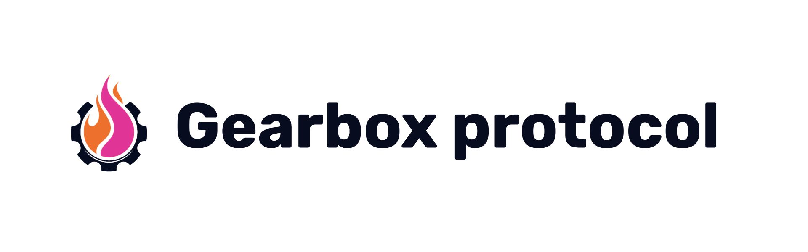
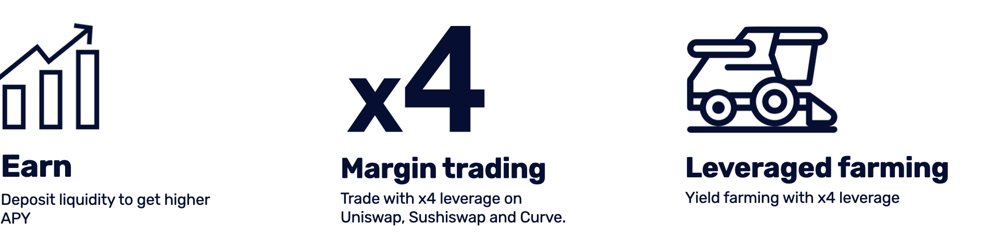
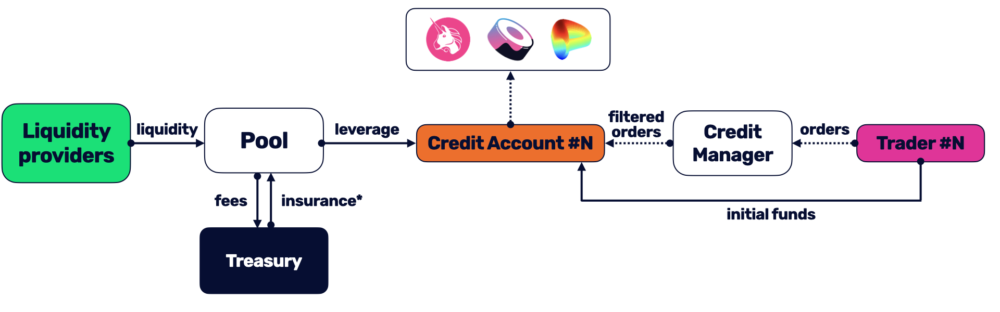

## Gearbox protocol
Gearbox is a generalized leverage protocol: it allows you to take leverage in one place and then use it across various DeFi protocols and platforms in a composable way. The protocol has two sides to it: passive liquidity providers who earn higher APY by providing liquidity to the protocol; and active traders or farmers who can borrow those assets to trade or farm with x4+ leverage.  

Gearbox aims to enhance capital efficiency in DeFi with the introduction of Credit Accounts - a new primitive for leveraged interactions with other DeFi protocols. Credit Accounts are isolated smart contracts with specific whitelisted actions and assets. Such an architecture ensures a higher degree of safety of both the user funds and the borrowed funds per account, through liquidation of a user's Credit Account portfolio under a certain health factor threshold. 

  
  

Gearbox does not silo the assets within its own platform. Needless to say, your assets never end up in any custody or under anyone’s control. All trades and operations happen on third-party protocols, which could apply to:
- margin trading on Uniswap;
- leverage farming on Yearn;
- arbitraging pegged assets on Curve;
- using your DAO treasury to optimize the holdings, and more!

The core vision is to become a backend leverage provider which all kinds of users have but don’t even need to interact directly with. You can envision building your own DeFi protocol and just making a “take leverage from Gearbox” as a button.

Gearbox protocol is Marketmake ETHGlobal hackathon finalist.

Twitter https://twitter.com/GearboxProtocol  
GitHub https://github.com/Gearbox-Protocol  
Discord https://discord.gg/jJuABVH9Pg   
Blog: https://medium.com/gearbox-protocol   
Website https://gearbox.fi/  

## Disclaimer

This application is provided "as is" and "with all faults." Me as developer makes no representations or
warranties of any kind concerning the safety, suitability, lack of viruses, inaccuracies, typographical
errors, or other harmful components of this software. There are inherent dangers in the use of any software,
and you are solely responsible for determining whether this software product is compatible with your equipment and
other software installed on your equipment. You are also solely responsible for the protection of your equipment
and backup of your data, and THE PROVIDER will not be liable for any damages you may suffer in connection with using,
modifying, or distributing this software product.
